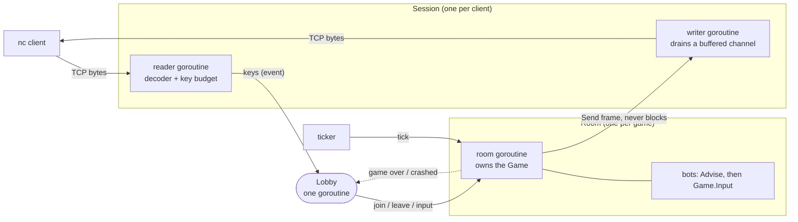

# GoCade

[](https://github.com/n9e6y/gocade/actions/workflows/ci.yml)

A multiplayer terminal-game server written in Go. Anyone can play by typing `nc host 9000`: no client
software, no dependencies, standard library only. Real-time Tron and turn-based Tic-Tac-Toe, with bots
for solo play.

<!-- Uncomment after recording (see docs/recording.md):

-->

Tron against the bot (colors omitted here; every player gets their own color, and your own head is highlighted):

```text
█ name (you)  █ Bot
+----------------------------------------+
|                                        |
|                                        |
|                                        |
|                                        |
|                                        |
|                                        |
|                                        |
|                                        |
|                                        |
|                                        |
|     ████           @██████████████     |
|        █                               |
|        █                               |
|        █                               |
|        █                               |
|        ██████@                         |
|                                        |
|                                        |
|                                        |
|                                        |
+----------------------------------------+
Steer with the arrow keys or W A S D
```

Tic-Tac-Toe against bot, and the menu:

```text
  Tic-Tac-Toe

   O | X | O
  ---+---+---
   4 | X | 6
  ---+---+---
   7 | O | X

  You are X (name)
  Opponent: Bot (O)
  Your turn
```

```text
  ARENA

  Hello, name!

  Pick a game:
    1) Tic-Tac-Toe
    2) Tron
    q) Quit
```

## Quickstart

```sh
git clone https://github.com/n9e6y/gocade.git
cd gocade
make demo
```

`make demo` builds the server, starts it in the background, connects your terminal, and stops everything
when you quit. Type a nickname, pick **2** (Tron), then **2** (play vs bot). You are playing within
seconds.

You need Go 1.23 or newer, `nc` (netcat) and a terminal of at least 70x24 on macOS or Linux (Windows: use
WSL). Everything below uses only these.

Want to play with a friend, or from another machine? Run the server in one terminal and connect from as
many others as you like:

```sh
make run                     # the server, on :9000
make play                    # each player, in their own terminal
```

`make play` is just this, with the terminal put back afterwards:

```sh
stty -icanon -echo; nc localhost 9000; stty sane
```

The `stty` line matters: it makes every key press reach the game at once, instead of waiting for Enter.

## How to play

1. Type a nickname and press Enter.
2. Pick a game with its number. For a game that has a bot you then choose **1) Play online** (you are
   matched with the next person who picks the same game) or **2) Play vs bot** (a private game starts at
   once).
3. **Tic-Tac-Toe:** press `1`-`9` to claim a cell. **Tron:** steer with the arrow keys or `W A S D`. Hit a
   wall, a trail or another head and you are out; the last one alive wins. Two to four players; a 3-2-1
   countdown starts when the second one arrives.
4. When a game ends, press Enter to return to the menu. `q` leaves a game (that forfeits it) and quits from
   the menu.

If you wait alone in an online room, a bot sits down after `-fill-wait` (10 seconds by default), so nobody
waits for ever.

## Architecture



### Who owns what

Every piece of mutable state has exactly one owning goroutine. Everyone else asks it over a channel.

| Goroutine | How many | Owns | Others reach it through | Stopped by |
|---|---|---|---|---|
| Accept loop (`server.Run`) | 1 | the listener and the connection slots | | context cancel (closes the listener) |
| Session reader (`server.serve`) | 1 per client | that client's input decoder and key budget | | client hangs up, idle timeout, or context cancel |
| Session writer | 1 per client | writes to that client's socket | a buffered channel; `Send` never blocks | the session's context ending |
| Lobby | 1 | every player, room, waiting list and fill timer | an events channel | context cancel, after the server has stopped |
| Room | 1 per room | its `Game`, its players' outputs and its bots | an events channel plus a tick channel | the lobby cancels its context; a panic also ends it |
| Room watcher | 1 per room | nothing: it tells the lobby "game over" or "crashed" | | its room's context |

## Design decisions and trade-offs

- **The `Game` interface is what a `Room` needs, and nothing more.** `Join`, `Leave`, `Input`, `Tick`,
  `View`, `State`, `Outcome` and two size methods. An illegal move is not an error: the game shows the
  player a message in their next view. *Cost:* the game, not the room, owns user-facing text.
- **One owner goroutine instead of locks.** A room owns its game, the lobby owns its room table, and
  there are no mutexes on the hot paths. *Cost:* every key press is two channel hops (session to lobby to
  room), and the single lobby goroutine is the first thing that would saturate at 10,000 players.
- **A slow client can never slow anyone else.** Each session has a buffered outbound channel and `Send`
  never blocks. When the buffer is full the oldest frame is dropped and counted, because every frame is a
  complete picture and the newest one (possibly the final result) is the one worth keeping. *Cost:* a slow
  client sees a choppy screen instead of a stalled game.
- **Time is injected.** Rooms receive a tick channel and the lobby receives its timer function, so tests
  fire ticks and timers by hand and never sleep to wait for a clock.
- **Games are pure.** No goroutines, no network, no clock, no randomness. The same inputs always give the
  same game, so a recorded input script replays to identical frames (there are tests for exactly that).
  Tron decides every move from the board at the start of the tick and applies them afterwards, so seat
  order gives nobody an advantage.
- **A bot is a player whose keys come from the game itself.** Games that can play implement a one-method
  `game.Advisor` (`Advise(player) -> key`). The room seats a bot through the same `Join` as a person and,
  after every change, feeds each bot's answer to `Game.Input`. No bot goroutines and no exported game
  state. Tic-Tac-Toe uses minimax (a test plays every possible human game and checks the bot never
  loses); Tron uses a flood fill over each safe direction. *Cost:* bot code runs on the room goroutine
  (measured below: microseconds), and the Tron bot is greedy, so a human can trap it.
- **A crash stays in its room.** A panic in a game, a bot or a render is recovered inside the room,
  logged with its stack, and the lobby sends its players back to the menu. *Limit:* a panic in the lobby
  or a session goroutine is not recovered.
- **Limits at the door.** A connection cap, an idle timeout and a per-client key budget (a token bucket:
  100 keys a second, bursts of 200), so one client cannot flood the lobby's event loop.
- **A stateful input decoder.** An arrow key is three bytes and TCP may split them across reads, so the
  decoder remembers partial input. A fuzz test checks that splitting a stream anywhere never changes the
  result. *Cost:* every game asks a key what it means (`Direction`, `Digit`, `IsQuit`) instead of switching
  on ready-made kinds, which keeps `w a s d q` typeable in a nickname.
- **Full-redraw frames.** Each frame redraws the whole screen without clearing it (no flicker) and draws
  control characters as spaces, so a nickname cannot inject escape codes into other terminals. *Cost:* more
  bytes than a diff; at this size the benchmark below shows it is cheap.
- **An explicit game registry.** No `init()` magic: the games are listed in one place in `cmd/arena`.
  *Cost:* the menu picks a game with a digit, so at most nine.

## Testing

```sh
make test                    # everything, with the race detector
make fuzz                    # the input decoder, 10 seconds (FUZZTIME=1m for longer)
make bench                   # benchmarks
make loadtest                # 50 rooms of fake players against a race-enabled server
```

- Table-driven tests for the rules (every Tron and Tic-Tac-Toe case in the spec), golden files for the
  renderer's exact bytes, replay tests for determinism, and a fake clock and hand-driven ticks for
  everything time-based.
- Rooms and the lobby are tested with fakes and `net.Pipe`; a few integration tests use a real listener
  on `127.0.0.1:0`. A 50-player stress test checks that nothing (player, room or goroutine) is left
  behind.
- Concurrency tests are checked by breaking the code on purpose (remove a `recover`, skip a release) and
  confirming they fail.
- CI runs vet, gofmt, the race-detector tests, a short fuzz run and every benchmark once, on the oldest
  and the newest Go.

**Benchmarks** (Apple M1 Pro, Go 1.26, `go test -bench . -benchmem`):

| Benchmark | Time per op | Allocated | What it measures |
|---|---|---|---|
| `BenchmarkRenderFrame` | 8.4 µs (630 MB/s) | 13.9 KB, 4 allocs | one 70x24 frame with mixed colors |
| `BenchmarkTronTick` | 43 ns | 80 B, 1 alloc | one tick with two heads moving |
| `BenchmarkTronView` | 6.2 µs | 18 KB, 5 allocs | drawing one player's frame, four players mid-round |
| `BenchmarkAdvise` (tron) | 35 µs | 29.7 KB, 8 allocs | one bot decision on the default board |
| `BenchmarkAdvise` (tictactoe) | 1.4 ms | none | the bot's reply to an opening move, its worst case |

A four-player Tron room costs well under a millisecond per 120 ms tick, about 0.1% of one core.

**Load test** (`make loadtest`; localhost, 50 rooms for 10 seconds, real 120 ms tick, server built with
`-race`, same machine). Fake players open real TCP connections, press random arrow keys and keep
re-joining, so rooms are created and closed all the time:

| Clients | Key presses | Frames a second per client | Time between frames (p50 / p99) | Failures |
|---|---|---|---|---|
| 100 (pairs) | every 100 ms | 15.9 | 50 ms / 119 ms | none |
| 50 (against bots) | every 100 ms | 20.6 | 47 ms / 107 ms | none |
| 100 (pairs) | every 3 s | 8.7 | 120 ms / 252 ms | none |

The race detector reported nothing and the server shut down cleanly. The last row is the tick itself:
one frame per 120 ms tick. With busy players the frame rate is higher because a room also sends a frame
after each key press (see Known limits).

## Add a game

A game is one package plus one line.

1. Create `internal/game/yourgame` with a type that implements `game.Game`: `Name`, `Seats`, `TickEvery`
   (zero for turn-based), `Join`, `Leave`, `Input`, `Tick`, `View`, `State` and `Outcome`. Keep it pure:
   no goroutines, no network, no clock.
2. Optionally add `Advise(player) (input.Key, bool)` (`game.Advisor`) to get "play vs bot" for free.
3. Add it to the list in `newRegistry` in `cmd/arena/main.go`:

```go
{"yourgame", "Your Game", func() game.Game { return yourgame.New() }, []lobby.EntryOption{lobby.WithBots()}},
```

Use `nil` instead of `lobby.WithBots()` if it has no bot. `Register` checks that a game offered with a bot
really is an `Advisor`.

## Flags

| Flag | Default | Meaning |
|---|---|---|
| `-addr` | `:9000` | TCP address to listen on |
| `-tick` | `120ms` | how often Tron advances (at least `10ms`) |
| `-log-level` | `info` | `debug`, `info`, `warn` or `error` |
| `-fill-wait` | `10s` | how long a player waits alone before a bot joins (`0` turns it off) |
| `-max-conns` | `1000` | most simultaneous connections (`0` for no limit) |
| `-idle-timeout` | `5m` | disconnect a client that sends nothing for this long (`0` turns it off) |

## Project layout

```text
cmd/arena        the server: flags, wiring, signal handling
cmd/loadtest     the load generator
internal/server  listener, sessions (reader and writer goroutines), connection limits
internal/input   raw bytes to key events
internal/render  canvas and ANSI frames
internal/game    the Game interface; tictactoe/ and tron/ (pure rules, views and bots)
internal/room    owns one game and runs its loop
internal/lobby   nicknames, menus, matchmaking, bots, room registry
internal/loadtest  the fake players behind cmd/loadtest
scripts/         play, demo and loadtest helpers used by the Makefile
```

## Known limits

- A room sends a frame after every key press as well as every tick. In Tron a key press changes nothing
  that is drawn, so those frames repeat the last one. Skipping byte-identical frames would fix it.
- The lobby is one goroutine. That is what keeps it simple and race-free, and it is the first thing to
  split (by game, say) if this had to serve thousands of players.
- Panics are recovered per room only, not in the lobby or session goroutines.
- Plain TCP: no TLS, no accounts, and nicknames are not unique. It is built for `nc` in character
  mode; `telnet` is untested.
- A terminal smaller than a game's screen (Tron needs 70x24) will scroll and garble the display.

## License

MIT, see [LICENSE](LICENSE).
